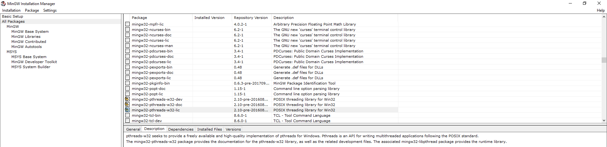
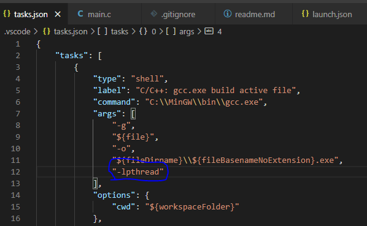

# Source Code Security project

## Intro
> Premature optimization is the root of all evil.
>
> -- *attributed to Donald Knuth*

This project is meant to simulate a possible effect of the Y2K bug that caused a lot of anxiety and panic at the end of the 20th century and forced many companies and governments to upgrade billions worth of equipment and software.

While the bug itself refers to an entire family of issues, from hardware limitations in old embedded systems to negligent programming practices, the root cause of this issue is that many computers developed during the 70's and 80's had designers that were overly optimistic about their organizations' willigness to change and upgrade and could not even conceive of these systems making it into the 2000s, let alone drive mission-critical systems. Yet many banks, governments and corporations during the late 90's found themselves in the unenviable position of having to conduct years-long systems audits on their own computers to figure out if they were affected, as many times such design flaws were buried deep within the architecture and were not at all obvious. 

The bug itself is often interpreted, as the opening quote suggests, as a premature and unnecessary optimisation, as storing only the last two digits of a year, such as `1999` as `99`, with the `19` being implicit, has the benefit of a smaller memory footprint - for instance, it can be stored as an unsigned integer of 1 byte (max value 255) rather than 2 (max value 65.535). In relatively modern systems, like 90's PC architecture chips such as the i486 or Pentium CPUs using DRAM memory of relatively generous size, such a design decision would probably seem ludicrous in the light of the issues that it later caused - however, bear in mind that many systems from the 70's and 80's had much more drastic memory and processing power limitations. Thus, that one extra byte may sometimes have conceivably been the line between viability and project failure. It is also a matter of conjecture that many developers, known to be creatures of habit, and used to such limitations, continued to implement them into software long after the "optimizations" were no longer of any practical benefit.

In any case, the direct material impact of the bug itself once 01.01.2000 hit was negligible, the most-cited example of actual issues, and by which the current project was inspired, having been parking meters in Dallas, TX continually crashing when attempting to sync their dates with a centralized server, probably due to different and incompatible internal representations of dates (though this is a matter of conjecture as well, since not a lot of good information can be found on the topic). This however fails to take into account the great amounts of money and time sunk into preventatively upgrading systems with then-new ones, many of which are still running today. 

Finally, there is a new horizon approaching that will result in a similar requirement to upgrade, namely the so-called Y2038 Bug. The UNIX timestamp, a standard format for representing dates as seconds passed since 01.01.1970 (The UNIX epoch), and a notably forward-looking design for the time that eschewed the issues with the Y2K bug, is implemented on many systems as a signed 32-bit integer. In 2038, any systems storing it as such will overflow, causing a reset to a very large negative number, whose interpretation will vary by system but will surely cause great disruption if allowed to unfold.

## Dev environment setup
### Prerequisites
 - Visual Studio Code with C/C++ extensions installed
 - MinGW and GCC installed

### Installing Pthread libraries
 - Access MinGW Installation manager
 - Mark `mingw-32-pthread-w32-dev` for installation
 - Install marked libraries. Note that MinGW Installation manager will install any dependencies as well
 

### Create VS Code launch config
 - Create a `.vscode` launch config for current project in VS Code (not needed if you clone this repo)
 - Update paths to debugger and compiler in `launch.json` and `tasks.json` if you have MinGW or GCC installed in places other than the default (only needed if you clone this repo)
 - Add the `-l pthread` flag to the GCC options in `launch.json` so it knows to link this library (not needed if you clone this repo)
 

Done! It should now be runnable and debuggable on your local machine.

# References
The Y2K Bug, *Encyclopedia Britannica*, retrieved on 08.11.2020 (https://www.britannica.com/technology/Y2K-bug)

## Author
Erik Kovacs (kovaroberik@gmail.com)